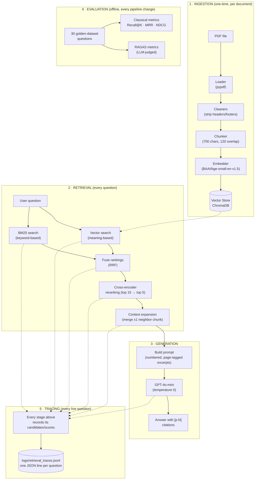

# Tax Filing Assistant — A RAG System, Explained From Zero

This project answers tax-filing questions (based on IRS Publication 15-T) by
reading the actual PDF and quoting it back — it never makes up an answer from
general knowledge. This README assumes you've never worked with AI/ML before
and walks through **exactly how it works**, using real numbers and real bugs
from this project along the way.

If you just want to run it, skip to [Running It Yourself](#running-it-yourself).

---

## Table of Contents

1. [The One-Paragraph Version](#the-one-paragraph-version)
2. [What Problem Is This Solving?](#what-problem-is-this-solving)
3. [The Librarian Analogy](#the-librarian-analogy)
4. [Architecture Diagram](#architecture-diagram)
5. [Project Layout](#project-layout)
6. [Step 1 — Reading the PDF (Ingestion)](#step-1--reading-the-pdf-ingestion)
7. [Step 2 — Cutting It Into Pieces (Chunking)](#step-2--cutting-it-into-pieces-chunking)
8. [Step 3 — Embeddings and the Vector Store](#step-3--embeddings-and-the-vector-store)
9. [Step 4 — Finding the Right Pieces (Retrieval)](#step-4--finding-the-right-pieces-retrieval)
10. [Step 5 — Double-Checking the Results (Reranking)](#step-5--double-checking-the-results-reranking)
11. [Step 6 — Not Cutting Off Mid-Sentence (Context Expansion)](#step-6--not-cutting-off-mid-sentence-context-expansion)
12. [Step 7 — Writing the Answer (Generation)](#step-7--writing-the-answer-generation)
13. [Step 8 — Proving It, Not Just Claiming It (Citations)](#step-8--proving-it-not-just-claiming-it-citations)
14. [Step 9 — How Do You Know Any of This Actually Works? (Evaluation)](#step-9--how-do-you-know-any-of-this-actually-works-evaluation)
15. [Step 10 — Watching It Think (Retrieval Tracing)](#step-10--watching-it-think-retrieval-tracing)
16. [Case Studies: The Bugs That Taught Us the Most](#case-studies-the-bugs-that-taught-us-the-most)
17. [Running It Yourself](#running-it-yourself)
18. [Glossary](#glossary)

---

## The One-Paragraph Version

A user asks a question like *"What is Form W-4P used for?"* The system
doesn't ask an AI model to answer from memory (AI models frequently make
things up, confidently and wrong — this is called **hallucination**).
Instead, it searches the actual IRS PDF for the most relevant passages,
hands **only those passages** to the AI model, and tells it: *"Answer using
only this text, and say so if the answer isn't in here."* The AI model then
writes a short answer and marks exactly which page each claim came from, so
a human can check it. Every piece of this pipeline — the search, the
double-checking, the answer-writing — was built one stage at a time and
**measured** at each step, using a set of 30 hand-written test questions with
known-correct answers. That measurement discipline is what this README
mostly walks through, because it's also what caught every real bug.

---

## What Problem Is This Solving?

Ask a general-purpose AI model "What's the standard deduction for 2026?"
and it will answer *something* — confidently — whether or not it actually
knows. It might be right. It might be a year out of date. It might be
invented outright. For a tax question, that's a real problem: a wrong answer
that sounds authoritative is worse than no answer.

**RAG (Retrieval-Augmented Generation)** is the standard fix: instead of
asking the model to answer from its own memory, you first **retrieve** the
relevant text from a trusted document, then ask the model to **generate** an
answer using *only* that text. The model becomes a careful reader and
summarizer of a specific document, not an oracle guessing from a blurry
memory of the whole internet.

---

## The Librarian Analogy

Every stage of this system maps to something a good research librarian does
when you ask them a question:

| RAG stage | Librarian equivalent |
|---|---|
| Ingestion & chunking | Photocopying the book, page by page, into a filing cabinet |
| Embeddings | Writing a one-line "topic summary" on each photocopy so similar pages can be found by topic, not just exact words |
| Retrieval | Pulling the ~15 photocopies that seem most relevant to your question |
| Reranking | Reading those 15 more carefully and keeping only the best 5 |
| Context expansion | Noticing a photocopy ends mid-sentence and grabbing the next page too |
| Generation | Writing you a short answer, using only what's in those 5 pages |
| Citations | Writing "(see page 7)" next to each fact so you can check it yourself |
| Evaluation | Having a supervisor spot-check the librarian's answers against a known-correct answer key, regularly, to catch bad habits early |

Keep this table in mind — every section below is one row of it, in detail.

---

## Architecture Diagram

The same pipeline as the table above, but as a flow — this is worth
glancing at before diving into the step-by-step sections below, and worth
coming back to as a map while reading them.



---

## Project Layout

```
ingestion/       Loading PDFs, cleaning text, building the vector index
chunking/        Splitting documents into chunks (recursive / semantic)
embedding/       Wraps the embedding model
vectorstore/     ChromaDB / FAISS / in-memory storage backends
retrieval/       Vector search, BM25, hybrid fusion, reranking, context
                 expansion, and the live /ask pipeline
llm/             The answer-generation model wrapper
cleaners/        Header/footer/whitespace cleanup for extracted PDF text
evaluation/      The 30-question golden dataset, classical + RAGAS scoring,
                 and the full history of what was tried and measured
                 (RETRIEVAL_EVALUATION_JOURNAL.md is worth reading in full)
utils/           Logging setup, and the per-request retrieval tracer
                 (utils/trace.py — see Step 10) that writes to logs/
logs/            Per-request trace files (git-ignored, generated locally —
                 see Step 10)
templates/       The web UI (comparison dashboard + live Q&A page)
tests/           Script-style tests for every component above
presentation/    A slide-deck summary of this whole project
experiments/     Superseded/abandoned code, kept for reference rather than
                 deleted (see experiments/README.md for why each file is there)
app.py           The FastAPI web app (routes: "/" comparison UI, "/ask" live Q&A)
config.py        Every tunable constant, each with a comment explaining why
                 that value was chosen
```

---

## Step 1 — Reading the PDF (Ingestion)

The source document is `data/pdf/IRS_Publication15T.pdf` — a 71-page IRS
publication about federal income tax withholding. The first job is just:
**get the text out of the PDF and into a form the rest of the system can
use.**

This sounds trivial but isn't. A PDF is really a set of drawing instructions
("put the letter 'F' at position x=120, y=340") — there's no built-in concept
of "this is a sentence" or "this is a paragraph." Different PDF-reading
libraries interpret those drawing instructions differently, which changes
what text comes out.

This project actually tried **four different PDF readers** and measured
which one worked best (see [`ingestion/registry.py`](ingestion/registry.py)):

| Reader | Speed (71 pages) | Retrieval quality | Verdict |
|---|---|---|---|
| **pypdf** | ~61–72s | **Best** (Recall@1 = 0.80) | **Default — used in production** |
| pymupdf4llm | ~215–394s | Worse retrieval, but better-phrased AI answers | Available as an option, not default |
| pdfplumber | ~68s | Worst retrieval on this document | Available as an option |
| unstructured | ~92s | Middling | Available as an option |
| Docling (layout-aware AI parser) | Minutes to **unbounded** — one page once took 90+ minutes | Roughly tied with pypdf | **Dropped entirely** — too unreliable |

That Docling row is a real lesson: a fancier tool isn't automatically
better. It cost 3–90x more time for no measurable quality gain on this
document, so it was removed from the codebase rather than kept "just in
case." Every choice in this pipeline was made this way — build it, measure
it, keep it only if the numbers justify it.

After the text is extracted, three small "cleaners" run over it
([`cleaners/`](cleaners/)) to strip PDF artifacts that would otherwise
confuse everything downstream — running headers ("Publication 15-T"),
footers ("IRS.gov"), and extra whitespace from the original page layout.

---

## Step 2 — Cutting It Into Pieces (Chunking)

You can't hand an AI model a 71-page document and say "find the answer" —
in practice this is slow, expensive, and the model tends to skim rather than
read carefully. So the document is cut into small pieces called **chunks**,
and the system searches *those* instead of the whole document.

This project's default (`RecursiveChunker`) cuts each page into chunks of
**700 characters**, with **120 characters of overlap** between consecutive
chunks (so a sentence that would otherwise be sliced in half by chunk
boundary #1 still appears whole in chunk #2). A real chunk from this
document looks like:

> *"Form W-4P Payees use Form W-4P to have payers withhold the correct
> amount of federal income tax from periodic pension, annuity (including
> commercial annuities), profit-sharing and stock bonus plan, or IRA
> payments..."*

There's also a second chunking strategy available, `SemanticChunker`, which
doesn't use a fixed character count at all — it groups sentences together
until the *meaning* shifts enough (measured via embeddings, the same
technique from Step 3 below), so boundaries land on topic changes instead
of an arbitrary character count.

### Why 700/120? It was measured, not guessed

The comparison dashboard built into this project
([`app.py`](app.py)'s `/` route) lets you run any chunker/chunk-size/overlap
combination against the 30-question test set with one click, and every run
gets logged to
[`evaluation/results/comparison_runs.csv`](evaluation/results/comparison_runs.csv).
Here's the actual sweep that led to the current defaults (all rows use the
same retriever — hybrid + reranking — so chunking is the only thing
changing):

| Chunker | Chunk size / overlap | Recall@1 | NDCG@10 |
|---|---|---|---|
| Recursive | 500 / 120 | 0.567 | 0.687 |
| Recursive | 600 / 120 | 0.467 | 0.639 |
| Recursive | 650 / 120 | 0.600 | 0.694 |
| **Recursive** | **700 / 120** | **0.733** | **0.814** ← best |
| Recursive | 750 / 120 | 0.667 | 0.777 |
| Recursive | 800 / 120 | 0.633 | 0.772 |
| Recursive | 900 / 100 | 0.700 | 0.747 |
| Semantic | (no size param) | 0.667 | 0.764 |

Two things worth noticing here: first, quality doesn't move smoothly as
chunk size increases (600 scores *worse* than 500) — this is a real,
somewhat counter-intuitive result of exactly where sentence boundaries
happen to fall relative to a fixed cutoff on this particular document, which
is exactly why it needs to be measured rather than assumed. Second,
semantic chunking — despite being the conceptually "smarter" approach — didn't
beat the best fixed-size result on this document. It's kept as an available
option, not the default, for the same reason Docling was dropped in Step 1:
being more sophisticated doesn't automatically mean better, and this project
only keeps what the numbers support.

### Why chunk IDs are a hash of (source file + chunker + chunk text)

Every chunk gets an ID computed like this:

```python
chunk_id = sha256(f"{source_file}|{chunker_name}|{chunk_text}")
```

This is the same idea as a Git commit hash: the ID is *derived from the
content itself*, not assigned sequentially. That single design choice buys
three things at once, and each one matters for a real reason:

1. **Including the chunk text** means identical content always produces the
   identical ID. This makes re-ingestion **idempotent** — if you run
   ingestion twice over an unchanged PDF, the second run computes the exact
   same 434 IDs, sees they're already stored, and skips re-embedding them
   (embedding is the slow, sometimes-paid step; skipping unchanged work here
   is a real speed win). It also means that if the source PDF is edited and
   re-ingested, only the chunks whose *text actually changed* get new IDs —
   everything else is recognized as unchanged automatically, with no manual
   bookkeeping.

2. **Including the source file name** stops chunks from *different*
   documents from colliding into the same ID, even if they happen to contain
   identical text (e.g. boilerplate legal language that appears in two
   different IRS publications). Each document's chunks stay distinctly
   trackable.

3. **Including the chunker name** is what let the entire chunking sweep in
   the table above run safely: switching from `recursive` to `semantic`, or
   from chunk-size 700 to 900, produces a *different* set of chunk IDs even
   over the same source PDF, so every experimental configuration gets its
   own isolated storage instead of overwriting or mixing with a previous
   experiment's chunks.

This exact ID scheme is also where a real, subtle bug lived — see the
[case study](#case-study-the-bug-that-taught-us-the-most) below. The lesson
there wasn't "content-hashing was a bad idea" (it wasn't) — it was that
*what exactly counts as "the same source file"* needs to be defined
carefully, because on some operating systems, two strings that look
different (`C:\file.pdf` vs `c:\file.pdf`) can point at the literal same
file.

---

## Step 3 — Embeddings and the Vector Store

This step has two halves that happen back to back for every chunk: turning
the chunk's text into numbers (**embedding**), then saving those numbers
somewhere they can be searched later (**the vector store**). Both matter,
and it's easy to only ever hear about the first half — so this section
covers both explicitly.

### Half 1: turning text into numbers (embeddings)

Here's the core trick that makes AI-powered search different from
`Ctrl+F`: **embeddings**.

An embedding model reads a piece of text and outputs a list of numbers (in
this project, 384 numbers) — a **vector** — that represents the *meaning* of
that text as a point in space. Two chunks about similar topics end up as
points that are close together in that space, even if they don't share a
single word in common.

> **Concretely:** the chunk *"Form W-4P is used to have payers withhold tax
> from pension payments"* and the query *"What is Form W-4P used for?"* share
> almost no exact words in common ("used" and "Form" and "W-4P" aside), but
> their embedding vectors land very close together, because an embedding
> model has learned that these sentences *mean* the same thing.

This project uses `BAAI/bge-small-en-v1.5`, a small open-source embedding
model that runs locally on a CPU (no external API call needed for this
step). Every chunk gets embedded once at ingestion time; every user
question gets embedded on the fly when asked, using that exact same model
(if the chunks and the question were embedded by two *different* models,
their vectors wouldn't be comparable at all — this consistency matters).

**"Closeness" between two vectors** is measured with **cosine similarity** —
a number between -1 and 1 describing how similar the *direction* of two
vectors is, regardless of their length. A score near 1 means "very similar
meaning"; near 0 means "unrelated."

### Half 2: loading chunks into the vector store

An embedding vector is useless on its own — it needs to live somewhere that
can answer "which of my thousands of stored vectors is closest to *this*
new vector?" quickly. That's the job of a **vector store** (also called a
**vector database**): a database purpose-built to index and search
embeddings efficiently, instead of comparing a query against every single
stored vector one by one.

This project uses **ChromaDB**, running locally and persisting to disk
under `vectorstore/chroma_data/`. The actual loading step
([`ChromaVectorStore.add()`](vectorstore/chroma_vector_store.py)) does three
things for each chunk:

1. Checks whether this chunk's ID (the content hash from Step 2) is
   **already stored** — if so, it's skipped rather than duplicated. This is
   what makes re-running ingestion over an unchanged document cheap.
2. If it's new, stores **three things together as one record**: the chunk's
   original text, its embedding vector, and its metadata (which page it
   came from, which document, its position in the document, etc.).
3. Chroma indexes the vector internally (using cosine distance — chosen to
   match how the embedding model above is meant to be compared) so that
   later, a query vector can be compared against all stored vectors and the
   closest ones returned quickly, without a slow one-by-one scan.

This is also why the [duplicate-chunk bug](#case-study-the-bug-that-taught-us-the-most)
below was a *storage* bug, not a search bug — step 1 above (the "already
stored?" check) is exactly the check that silently failed.

---

## Step 4 — Finding the Right Pieces (Retrieval)

Now the actual search. This project runs **two completely different search
methods on every question, at the same time**, then merges their results.
Here's why, one method at a time.

### Method A: Vector search (search by meaning)

The user's question gets embedded (Step 3) into the same 384-number space
as every chunk. The vector store then finds the chunks whose vectors are
closest to the question's vector. This is what lets a question like *"What
is Form W-4P used for?"* find a chunk that never uses the word "used" —
because the *meaning* is close, even though the exact wording differs.

**Where it struggles:** vector search can get confused by two passages that
are topically similar but factually different — like Form W-4 vs. the very
similarly-worded Form W-4P — because their embeddings can land close
together even though a human would immediately see they're about different
forms. It's also weaker on exact, specific tokens (a dollar figure, a form
code) that don't carry much "meaning" of their own.

### Method B: BM25 (search by keyword)

BM25 is a decades-old algorithm — the same family of idea behind classic
keyword search engines, long before embeddings existed. It has no concept
of "meaning" at all; it scores a chunk based on how many of the question's
*exact words* it contains, weighted so rare/distinctive words (like "W-4P"
or a specific dollar figure) count for more than common ones (like "the" or
"payment").

**Where it struggles:** it's blind to paraphrase. A question asking about
"the yearly tax-free amount" won't match a chunk that only ever says
"annual exclusion" — there's no word overlap at all, even though a human
reader would recognize they mean the same thing.

### Combining them: Reciprocal Rank Fusion (RRF)

Each method independently produces its own ranked list of candidate chunks.
These two lists are merged using a formula called **RRF**: every chunk's
combined score is

```
score = 1 / (60 + rank_in_vector_list) + 1 / (60 + rank_in_BM25_list)
```

(A chunk missing from one list entirely just contributes 0 for that term.)
The `60` is a damping constant — it stops whichever method happens to rank
something #1 from automatically dominating the fused list; what matters
most is a chunk that **both** methods agree is at least reasonably relevant.

**A worked example**, to make the arithmetic concrete: imagine the vector
search ranks Chunk A at position 2 and BM25 ranks that same chunk at
position 5 — both methods "like" it, even if not identically. Its combined
score is `1/(60+2) + 1/(60+5) = 1/62 + 1/65 ≈ 0.0316`. Now compare Chunk B,
which vector search loved (ranked #1) but BM25 didn't find in its list at
all: `1/(60+1) + 0 ≈ 0.0164`. Even though Chunk B got a *better single
rank* from one method, Chunk A — agreed on by both — ends up scored almost
twice as high. That's the whole point of hybrid search: agreement between
two different, differently-flawed methods is a stronger signal than either
method's opinion alone.

### Did this actually help? (measured, not assumed)

From the same experiment log used in Step 2
([`evaluation/results/comparison_runs.csv`](evaluation/results/comparison_runs.csv)),
here's vector-search-alone vs. hybrid vs. hybrid-plus-reranking (Step 5), on
the identical 30-question test set:

| Retriever | Recall@1 | NDCG@10 |
|---|---|---|
| Vector search alone | 0.400 | 0.593 |
| Hybrid (vector + BM25, no reranking) | 0.567 | 0.695 |
| Hybrid + reranking (Step 5) | 0.733 | 0.814 |

Adding BM25 back into a vector-only system was one of the first measured
improvements in this project's history — see
[`evaluation/RETRIEVAL_EVALUATION_JOURNAL.md`](evaluation/RETRIEVAL_EVALUATION_JOURNAL.md)
for the full account of *why* it was tried (vector-only was missing
exact-term matches like specific form names and figures).

---

## Step 5 — Double-Checking the Results (Reranking)

The hybrid search above is deliberately cast **wide** — it pulls back 15
candidate chunks instead of just the final 5, because speed matters more
than precision at this stage. The next stage narrows it back down.

A **cross-encoder** reranker (`cross-encoder/ms-marco-MiniLM-L-12-v2`) reads
the user's question *together with* each of the 15 candidate chunks — one
pair at a time — and scores how well they actually match. This is slower
than the vector/BM25 search (it can't be precomputed, since it depends on
the specific question), which is exactly why it only runs on the narrowed-down
15 candidates rather than the whole document.

**Why this step matters — a real example from this project:** the vector +
BM25 search alone sometimes can't tell **Form W-4** apart from **Form
W-4P** (a similar but different form for pension payments, not paychecks) —
they're extremely similar in wording. The reranker, reading the actual
question and chunk together, is much better at catching this distinction.
This project logs one case (question `gd_027` in the test set) where even the
reranker got this wrong — it's an accepted, documented limitation, not
something quietly ignored (see
[`evaluation/RETRIEVAL_EVALUATION_JOURNAL.md`](evaluation/RETRIEVAL_EVALUATION_JOURNAL.md),
Step 14).

Adding this reranking stage was the single biggest measured improvement in
the whole project: precision jumped from an average of **0.7587 to 0.8508**
against the 30-question test set.

---

## Step 6 — Not Cutting Off Mid-Sentence (Context Expansion)

Chunk boundaries are arbitrary — they're wherever the 700th character
happened to fall, not wherever a sentence or idea actually ends. Sometimes
the single best-matching chunk is missing a sentence that got cut into the
*next* chunk instead.

**Context expansion** fixes this: after the top chunks are chosen, the
system looks up each chunk's immediate neighbors *by position in the
document* (not by search relevance) and merges them in — one chunk before,
one chunk after.

Measured impact of adding this stage (30-question test set, before →
after):

| Metric | Before | After |
|---|---|---|
| Recall@1 | 0.700 | 0.767 |
| Recall@5 | 0.800 | 0.900 |
| NDCG@10 | 0.788 | 0.845 |
| RAGAS Context Recall (LLM-judged) | 0.872 | 0.972 |

*(See [`evaluation/results/context_expansion_comparison_20260826_224555.csv`](evaluation/results/)
for the raw per-question data.)*

### The bug this stage introduced, and how it was caught

Expanding each chunk's neighbors *independently* has a failure mode: if two
of the top-ranked chunks are themselves neighbors — e.g. chunk 3 and chunk 4
on the same page both survive reranking — expanding each one separately
gives overlapping windows (chunk 3 pulls in [2,3,4], chunk 4 pulls in
[3,4,5]). Chunks 3 and 4 then show up, in full, **inside both** expanded
excerpts. The model would see the same paragraph twice, tagged with two
different page citations, and a user would see two near-identical source
cards in the UI for what was really one contiguous passage.

The fix: before returning results, `ContextExpandingRetriever` now checks
whether any two surviving chunks' expansion windows overlap on the same
page, and merges them into a single excerpt instead of returning both. See
[`retrieval/context_expander.py`](retrieval/context_expander.py) — this is
also a good example of Step 10 below, since the duplicate was actually
found by inspecting a real trace, not by reading the code first.

---

## Step 7 — Writing the Answer (Generation)

At this point the system has ~5 well-chosen, boundary-safe chunks of real
document text. The last step hands them to a large language model —
**OpenAI's GPT-4o-mini** — along with a strict instruction:

> *"Answer the user's question using ONLY the provided context excerpts
> below. If the context does not contain enough information to answer the
> question, say so explicitly instead of guessing or using outside
> knowledge. Answer in 1-2 sentences, stating only the specific fact(s) the
> question asks for."*

This is called the **system prompt**, and it's the whole reason this counts
as *retrieval-augmented* generation rather than just "asking ChatGPT." The
model is deliberately boxed in: it can only work with what it was handed,
and it's told explicitly to admit ignorance rather than fill gaps with
plausible-sounding guesses.

**Temperature is set to 0** — this is a setting that controls how
"creative"/random the model's word choices are. At 0, the model always picks
its highest-confidence next word, making answers as repeatable as an LLM can
be (useful when you're trying to measure and compare pipeline changes
reliably).

---

## Step 8 — Proving It, Not Just Claiming It (Citations)

An answer that *sounds* grounded isn't the same as an answer you can
actually verify. So this project goes one step further: every chunk handed
to the model is tagged with **the actual PDF page it came from**, and the
model is instructed to cite that page after every claim it makes.

**A real example**, asking *"What is Form W-4P used for?"*:

> *"Form W-4P is used to make withholding elections for periodic pension or
> annuity payments* **[p.2]***."*

That `[p.2]` isn't decoration — click it in the web UI and it jumps straight
to the actual source card showing the retrieved text from page 2, so a
human can check the claim against the original document in one click. This
was deliberately built to cite the **page number itself**, not just "source
#2" (an earlier version did this, and it required an extra lookup step to
find out what "#2" even meant — tracing straight to the page is strictly
better).

---

## Step 9 — How Do You Know Any of This Actually Works? (Evaluation)

Every stage described above was added because it was **measured** to help,
using a set of 30 hand-written test questions
([`evaluation/golden_dataset_with_retrieval_ground_truth.json`](evaluation/golden_dataset_with_retrieval_ground_truth.json))
with known-correct answers and known-correct source pages. Two completely
different scoring methods are used, because each one is blind to something
the other catches:

### Classical metrics (free, exact, a little dumb)

These check whether the *exact evidence text* was found, by simple string
matching. No AI involved, so they're fast, free, and perfectly
reproducible — but they don't understand paraphrasing.

- **Recall@K** — of the questions with a known answer, what fraction were
  found somewhere in the top K retrieved chunks?
- **MRR (Mean Reciprocal Rank)** — on average, how close to rank #1 was the
  first correct chunk? (Finding it at rank 1 scores 1.0; at rank 4 scores
  0.25.)
- **NDCG@10** — like Recall, but also rewards *ranking* the right answer
  higher, not just including it somewhere in the top 10.

### RAGAS metrics (LLM-judged, smarter, costs real API calls)

These use a second AI model as a judge, so they can catch semantic
correctness even when the wording is completely different from the
reference answer:

- **Context Precision** — of the chunks that *were* retrieved, what fraction
  were actually necessary/relevant, and were the relevant ones ranked near
  the top? This measures **noise**. A judge LLM checks each retrieved chunk
  against the reference answer and scores whether it was actually needed.
  *Example of low precision:* retrieving 10 chunks where the 1 needed fact
  is buried at position 9, padded out by 8 irrelevant ones — the answer
  could still come out right, but most of what was retrieved was clutter,
  and clutter ranked ahead of the real answer is exactly what Step 5's
  reranking exists to clean up.
- **Context Recall** — of everything the reference answer actually needed,
  how much of it was found *somewhere* in the retrieved chunks at all? This
  measures **completeness**, and doesn't care about ranking or extra noise.
  *Example of low recall:* a question whose correct answer requires two
  facts from two different pages, but retrieval only found one of them — no
  amount of clean ranking fixes an answer that's missing information it
  never received.

  These two are opposites in what they penalize: a retriever that returns
  *everything remotely related* to a topic can have great recall (nothing's
  missing) but poor precision (mostly noise). A retriever that returns only
  one very safe, narrow chunk can have great precision (no noise) but poor
  recall (it might have missed something needed). A good pipeline needs
  both — which is exactly why both are measured separately instead of being
  collapsed into one number.
- **Faithfulness** — is every claim in the generated answer actually
  backed by the retrieved text? (Catches hallucination.)
- **Answer Relevancy** — does the answer actually address the question
  asked?
- **Answer Correctness** — does the answer match the known-correct
  reference answer?

### The final numbers (pypdf, current production configuration)

| Metric | Score | What it means in plain terms |
|---|---|---|
| Recall@10 | **1.000** | The right information was somewhere in the top 10 results, every single time |
| MRR | 0.869 | The right chunk is usually ranked #1 or very close to it |
| Context Precision (RAGAS) | 0.920 | ~92% of what's retrieved is actually relevant, not noise |
| Context Recall (RAGAS) | **1.000** | Everything a reference answer needed was found among the retrieved chunks, every time |
| Faithfulness (RAGAS) | 0.874 | ~87% of claims the model makes are directly backed by the retrieved text |
| Answer Relevancy (RAGAS) | 0.949 | Answers almost always actually address the question asked |
| Answer Correctness (RAGAS) | 0.736 | Lower than the others — see below, this one has a known, well-understood ceiling |

**Why is Answer Correctness the lowest number, and is that a problem?**
This was investigated directly, not just accepted at face value. Tracing
individual low-scoring questions revealed it wasn't one problem, it was
three different ones tangled together:

1. A genuine retrieval bug (see the case study below) — fixed, and the
   score moved.
2. Two test questions where the "known-correct" reference answer itself
   didn't actually answer the question it was attached to — fixed by
   rewriting those two reference answers.
3. A structural quirk of how this metric works: it checks word/claim
   overlap against a short reference answer, so a correct answer that's
   phrased differently, or slightly more detailed, gets marked down even
   though it's not wrong. This is a property of the *scoring method*, not
   the *answer* — and deliberately not "fixed" by tuning the model to mimic
   the reference's exact phrasing, because that would optimize the score
   instead of the actual answer quality.

---

## Step 10 — Watching It Think (Retrieval Tracing)

Step 9's metrics answer *"is the pipeline good, on average, across 30
questions?"* — but they don't answer *"why did **this specific** question's
answer cite page 7 when page 2 scored higher?"*. That second kind of
question needs to see every intermediate decision for one request, not an
aggregate score. This project adds a lightweight tracer for exactly that.

**How it works:** every stage of the pipeline — query embedding, BM25
search, vector search, RRF fusion, cross-encoder reranking, context
expansion, generation — writes a small structured record as it runs. Once
the request finishes, all of those records are written as **one line of
JSON** to [`logs/retrieval_traces.jsonl`](logs/) (this file is
git-ignored — it's a local debugging artifact, not project data, and it may
contain the literal text of questions asked). Every answer shown in the
`/ask` UI displays a short `trace <id>` tag — that id is the exact line to
go find in the log.

**A real example of what this catches.** Asking *"What is Form W-4P used
for?"*, the cross-encoder scored a "page 2" chunk at `7.3515` — very
slightly higher than a "page 7" chunk at `7.3489` — yet the model's answer
cited `[p.7]`. Reading the trace's `generation` stage (which logs the
*exact* excerpt text sent to the model, not just its score) makes the
reason obvious: the page 2 chunk only talks *around* the form — historical
context, worksheet cross-references — while the page 7 chunk contains the
literal defining sentence, *"Payees use Form W-4P to have payers withhold
the correct amount of federal income tax from periodic pension, annuity...
payments."* The reranker's score measures topical relevance; it's never
shown to the model at all, and doesn't decide which chunk gets cited — the
model reads the actual text and cites whichever chunk contains the fact it's
about to state. A retrieval score answers "how relevant does this look?";
citation choice answers a different question, "which chunk actually proves
this claim?" — the trace is what makes that distinction checkable instead
of just asserted.

**One deliberate design choice worth calling out:** every page number
logged in the trace — in every stage — is the same 1-indexed number a human
reader would see printed on the physical PDF page, matching the `[p.N]`
citation exactly. Internally, `page` in a chunk's metadata is 0-indexed
(page 1 of the PDF is stored as `page: 0`) — a raw, unconverted trace would
show `page: 1` for a chunk while the answer cites `[p.2]`, which is
confusing in exactly the way that makes debugging harder, not easier. See
`page_display()` in [`utils/trace.py`](utils/trace.py).

Why not an existing tracing tool (Langfuse / Arize Phoenix)? Mainly because
the debugging questions that actually came up here were project-specific —
"did the reranker drop this chunk, or did fusion never surface it at all?",
"did the expansion-merge actually collapse the duplicate?" — and answering
those needs custom fields inside this project's own retriever code either
way, regardless of which library logs them. A ~100-line local module with
zero new dependencies and zero new services already answers every debugging
question that's come up so far; a full tracing platform is worth adopting
later if this grows into something a team debugs together, not before.

---

## Case Studies: The Bugs That Taught Us the Most

This section exists because it's a genuinely good example of how the
evaluation discipline above catches real problems, not just tunes numbers.

### Case Study 1: The Duplicate-Chunk Bug

**The symptom:** asking *"What are the five steps on Form W-4?"* — a
question the document clearly answers — the model refused: *"The context
does not provide the specific details of the five steps on Form W-4."*

**The investigation:** the retrieval step was checked directly, and the
correct chunk *was* being found (ranked #3 out of the top 10). So the
failure wasn't in search — it was in what the model actually received.

**The discovery:** every single retrieved result was appearing **twice**,
back to back, with identical scores. The database that stores all the
chunks had **868 entries** — but this document should only produce **434**.

**The root cause:** each chunk's ID is computed from a hash of `(source file
path + chunker name + chunk text)`. On Windows, a file path can be written
as `C:\...` or `c:\...` — same file, different string. Across different runs
of the ingestion process, the *casing* of that path happened to vary, so
identical chunk text was hashed to two different IDs and stored twice. The
duplicate wasn't random noise — it specifically buried the correct Form W-4
information behind a near-identical, wrong-form (Form **W-4P**) chunk,
which the model — correctly trying not to conflate two different tax forms —
refused to trust.

**The fix:** the file path is now lower-cased before it's hashed
(`BaseDocumentLoader.normalize_source()`), so identical content always
produces the identical ID no matter how the process was launched. The
corrupted database was wiped and rebuilt (868 → 434, correct).

**The hardening:** rather than trusting this one fix to be the last word on
the subject, the system was changed so that **every time the app restarts,
the entire vector database is wiped and rebuilt from scratch** — see
`fresh=True` in [`ingestion/build_index.py`](ingestion/build_index.py). This
means this entire *class* of bug (anything that could cause silent
duplication over time) can no longer accumulate, even if some future,
different cause of duplication is introduced.

**The measured payoff** — re-running the full 30-question evaluation after
this fix:

| Metric | Before fix | After fix |
|---|---|---|
| Recall@10 | 0.933 | **1.000** |
| Faithfulness | 0.820 | **0.874** |
| Answer Correctness | 0.679 | **0.736** |

### Case Study 2: Overlapping Context Windows

**The symptom:** asking *"What is Form W-4P used for?"*, the `/ask` UI
showed **two** near-identical source cards both tagged "page 2," sharing
large blocks of overlapping paragraph text.

**The cause:** covered in detail in [Step 6](#step-6--not-cutting-off-mid-sentence-context-expansion)
above — two of the top-ranked chunks were themselves adjacent (chunk 3 and
chunk 4 of the same page), so expanding each one's ±1 neighbor window
independently produced two overlapping excerpts instead of one.

**How it was found:** by reading a real [Step 10](#step-10--watching-it-think-retrieval-tracing)
trace for that exact question and noticing the `context_expansion` stage
had 5 chunks going in and 5 coming out — no merge happening at all — while
two of those 5 output entries clearly described the same page range.

**The fix:** `ContextExpandingRetriever.retrieve()` now detects overlapping
windows and merges them into one excerpt before returning (see
`retrieval/context_expander.py`). Re-running the same question afterward:
5 chunks in, **4** out, `overlapping_groups_merged: 1` — logged directly in
the trace, so the fix is verifiable from the same log that caught the bug.

---

## Running It Yourself

```bash
# 1. Install dependencies
pip install -r requirements.txt

# 2. Add your OpenAI API key (needed for answer generation and for the
#    RAGAS evaluation judge — not needed for retrieval alone)
echo "OPENAI_API_KEY=sk-..." > .env

# 3. Start the web app
uvicorn app:app --reload

# 4. Open a browser to:
#    http://127.0.0.1:8000/ask   - ask a live question
#    http://127.0.0.1:8000/      - compare retrieval configurations
```

The vector store is wiped and rebuilt from the PDF on every app **startup**
(roughly a minute, before the server starts accepting requests — see
[Case Study 1](#case-study-1-the-duplicate-chunk-bug) for why), not on the
first request; after that, questions answer in under two seconds.

Every question asked writes a debugging trace to
[`logs/retrieval_traces.jsonl`](logs/) — see [Step 10](#step-10--watching-it-think-retrieval-tracing)
for how to read it.

To run the evaluation suite yourself (no server needed):

```bash
python tests/test_retrieval_metrics.py     # classical metrics, free
python tests/test_ragas_evaluator.py       # RAGAS metrics, uses OPENAI_API_KEY
```

---

## Glossary

Terms used above, in plain language, for quick reference.

| Term | Plain-English meaning |
|---|---|
| **LLM (Large Language Model)** | An AI model trained on huge amounts of text that can read and write natural language (e.g. GPT-4o-mini). |
| **Hallucination** | When an AI model states something false with full confidence, because it's generating plausible-sounding text rather than looking anything up. |
| **RAG (Retrieval-Augmented Generation)** | Searching a trusted document first, then asking an AI model to answer using only what was found — instead of asking it to answer from memory. |
| **Chunk** | A small piece of a document (here, ~700 characters) — the unit that gets searched and retrieved. |
| **Embedding** | A list of numbers representing the *meaning* of a piece of text, so similar meanings end up as nearby points in space. |
| **Vector** | The list of numbers an embedding produces — a point in (here) 384-dimensional space. |
| **Cosine similarity** | A score (-1 to 1) for how similar two vectors' *directions* are — the standard way to compare embeddings. |
| **Vector store / vector database** | A database built to store embeddings and quickly find the nearest ones to a query (ChromaDB, here). |
| **BM25** | A classic keyword-matching search algorithm — scores exact term overlap, no AI involved. |
| **Hybrid retrieval** | Running vector search and BM25 together and combining the results, so you get both meaning-matching and exact-term-matching. |
| **RRF (Reciprocal Rank Fusion)** | The specific formula used to combine two ranked lists of search results into one. |
| **Reranking / cross-encoder** | A slower, more careful second-pass model that reads the question and a candidate chunk *together* to score how well they really match. |
| **Context expansion** | Pulling in a retrieved chunk's neighboring chunks (by position in the document) so an answer isn't cut off mid-thought by an arbitrary chunk boundary. |
| **System prompt** | The instructions given to an LLM before the user's actual question — used here to force the model to answer only from provided text. |
| **Temperature** | A setting controlling how random/creative an LLM's word choices are; 0 means "always pick the most likely next word." |
| **Citation** | A marker (here, `[p.N]`) pointing an answer's claim back to the specific source page it came from. |
| **Tracing / trace** | A structured, per-request log of every intermediate step a system took to produce one output — used here to debug a single question's answer, as opposed to evaluation metrics, which measure overall quality across many questions. |
| **Golden dataset** | A set of test questions with known-correct answers, used to measure whether the system is actually working. |
| **Recall@K** | Of everything that *should* have been found, what fraction was found in the top K results? |
| **MRR (Mean Reciprocal Rank)** | On average, how close to the #1 ranked result was the first correct one? |
| **NDCG** | A ranking-quality score that rewards putting the correct answer *higher up*, not just including it somewhere. |
| **RAGAS** | An evaluation library that uses an LLM as a judge to score retrieval and answer quality (faithfulness, relevancy, correctness) — smarter than exact-text matching, but costs real API calls and judge-model variance. |
| **Faithfulness** | Whether every claim in a generated answer is actually backed by the retrieved text (catches hallucination). |
| **chunk_id** | A unique ID computed from a hash of a chunk's source + chunker + text — used to avoid storing the same chunk twice. |
